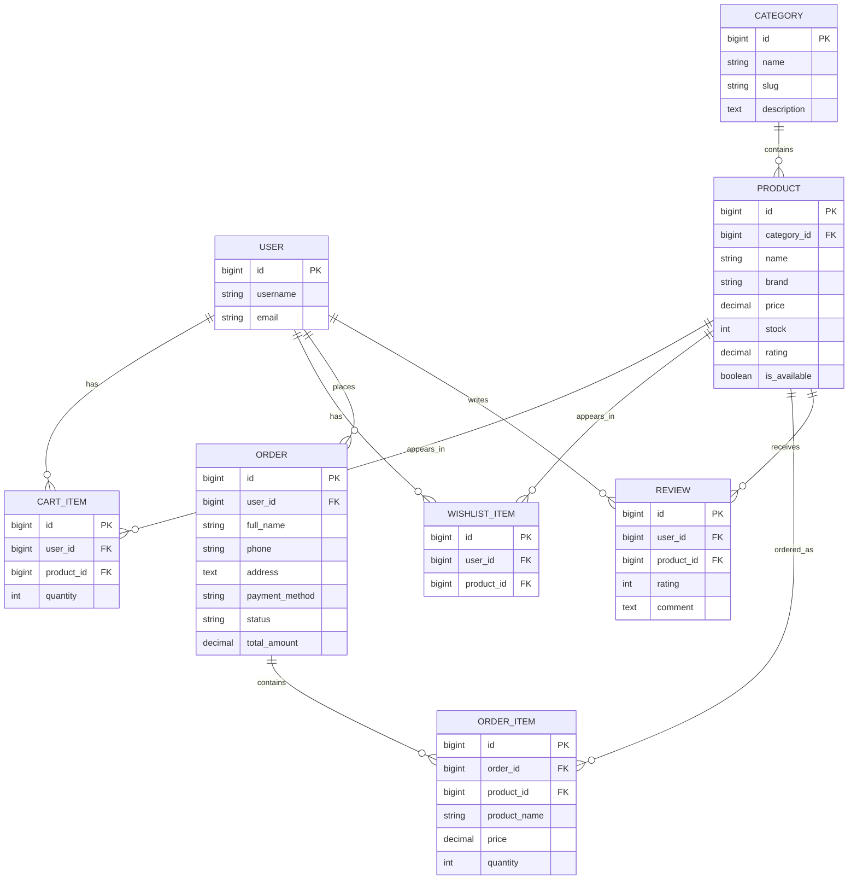

# ElectroMart ER Diagram

```mermaid
erDiagram
    USER ||--o{ CART_ITEM : has
    USER ||--o{ WISHLIST_ITEM : has
    USER ||--o{ ORDER : places
    USER ||--o{ REVIEW : writes

    CATEGORY ||--o{ PRODUCT : contains

    PRODUCT ||--o{ CART_ITEM : appears_in
    PRODUCT ||--o{ WISHLIST_ITEM : appears_in
    PRODUCT ||--o{ ORDER_ITEM : ordered_as
    PRODUCT ||--o{ REVIEW : receives

    ORDER ||--o{ ORDER_ITEM : contains

    USER {
        bigint id PK
        string username
        string email
    }

    CATEGORY {
        bigint id PK
        string name
        string slug
        text description
    }

    PRODUCT {
        bigint id PK
        bigint category_id FK
        string name
        string brand
        decimal price
        int stock
        decimal rating
        boolean is_available
    }

    CART_ITEM {
        bigint id PK
        bigint user_id FK
        bigint product_id FK
        int quantity
    }

    WISHLIST_ITEM {
        bigint id PK
        bigint user_id FK
        bigint product_id FK
    }

    ORDER {
        bigint id PK
        bigint user_id FK
        string full_name
        string phone
        text address
        string payment_method
        string status
        decimal total_amount
    }

    ORDER_ITEM {
        bigint id PK
        bigint order_id FK
        bigint product_id FK
        string product_name
        decimal price
        int quantity
    }

    REVIEW {
        bigint id PK
        bigint user_id FK
        bigint product_id FK
        int rating
        text comment
    }
```